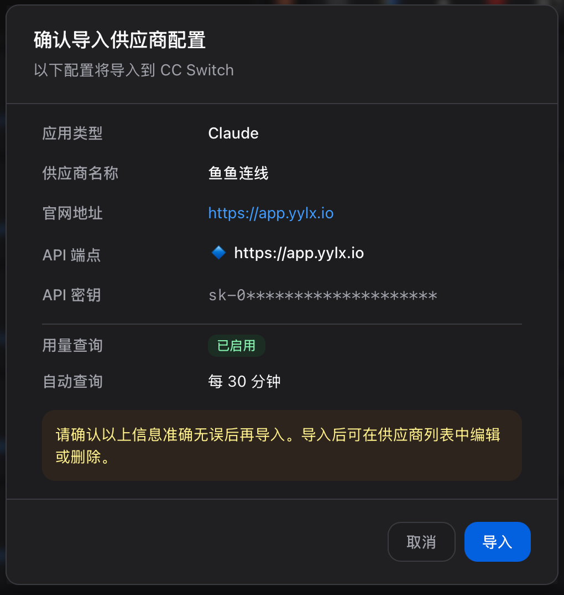
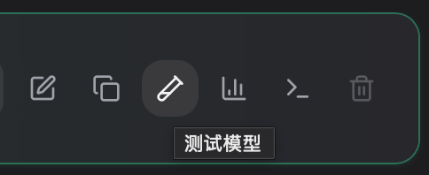

# 导入到 CC Switch

CC Switch 是一个跨平台的 AI CLI 配置管理工具，可用于集中管理 Claude Code、Codex、Gemini CLI、OpenCode 等工具的模型提供商（Provider）配置。它把 Base URL、API Key、模型名称等信息统一保存，让你在多个 CLI 工具或多套 Provider 之间一键切换，避免反复修改环境变量或配置文件。

## 下载安装

CC Switch 是开源项目，源码托管在 GitHub：[farion1231/cc-switch](https://github.com/farion1231/cc-switch)。

1. 打开 [Releases 页面](https://github.com/farion1231/cc-switch/releases)。
2. 在最新版本的资源列表中，根据自己的操作系统选择对应的安装包：
   - macOS：`.dmg`
   - Windows：`.msi`
   - Linux：`.AppImage` / `.deb`
3. 下载完成后按系统正常方式安装，并至少打开一次 CC Switch，方便后续一键导入识别到本机已安装。

## 一键导入

推荐使用一键导入，一键即可把 Provider 配置直接写入本机 CC Switch，无需手动填写配置信息。

#### 操作流程：
1. 确认本机已经安装并打开过 CC Switch。
2. 进入 yylx.io 控制台的 [API 密钥](https://app.yylx.io/keys) 页面。
3. 找到要给 CC Switch 使用的 Key。
4. 点击该行右侧的「导入到 CCS」。
 <image src="../assets/screenshots/access/ccswitch-import-button.png" alt="CCS 导入确认" style="width: 400px">
5. 浏览器或系统可能会询问是否允许打开 CC Switch，确认并导入。

> [!WARNING]
> 一键导入会把当前 API Key 写入本机 CC Switch 配置。请只在自己的电脑上操作，不要在共享电脑或远程临时环境中导入。

## 手动添加 Provider

| 字段 | 填写内容 |
| --- | --- |
| 预设供应商 | 自定义配置 |
| 供应商名称 | `yylx.io` |
| 官方链接 | ` https://app.yylx.io` |
| API Key | 在 yylx.io 控制台创建的 Key |
| API 请求地址 | `https://app.yylx.io`(不要勾选 「完整URL」) |

## 验证是否生效
