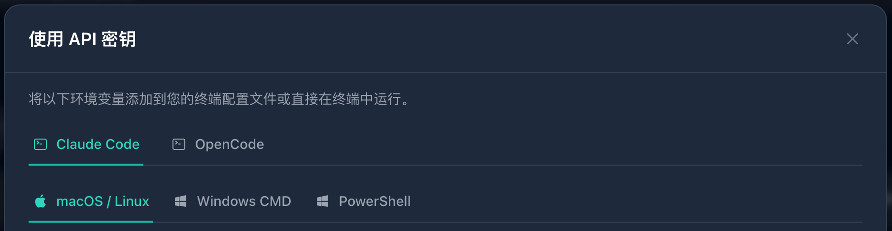

# 导入到 Claude Code

> [!WARNING]
> 推荐使用 [CC Switch](cc-switch.md) 来管理和切换 Claude Code 的 Provider 配置，无需手动改环境变量或配置文件。

Claude Code 使用 Anthropic 相关配置项。通过 yylx.io 接入时，不要填写 OpenAI 兼容地址 `https://app.yylx.io//v1/messages`，而应该使用控制台「使用密钥」弹窗展示的 Claude Code 配置。

> [!TIP]
> 如果你同时使用 Claude 官方订阅和 yylx.io API Key，建议把两套配置放在不同终端配置或 CC Switch Profile 中，避免环境变量互相覆盖。

## 从控制台复制配置

在 yylx.io 控制台进入「API 密钥」页面，找到要用于 Claude Code 的 Key，点击右侧「使用密钥」。弹窗中选择 `Claude Code`，再根据你的系统选择 `macOS / Linux`、`Windows CMD` 或 `PowerShell`。



这里展示的配置会自动带入当前 Key。文档中的示例会用 `sk-your-api-key` 代替真实 Key。

## 临时环境变量方式

如果你只是临时测试，可以在当前终端中运行：

```bash
export ANTHROPIC_BASE_URL="https://app.yylx.io"
export ANTHROPIC_AUTH_TOKEN="sk-your-api-key"
export CLAUDE_CODE_DISABLE_NONESSENTIAL_TRAFFIC=1
claude
```

这种方式只对当前终端会话生效。关闭终端后，环境变量会失效。

如果你的系统或当前 Claude Code 版本要求使用 `ANTHROPIC_API_KEY`，也可以按控制台说明改为：

```bash
export ANTHROPIC_BASE_URL="https://app.yylx.io"
export ANTHROPIC_API_KEY="sk-your-api-key"
export CLAUDE_CODE_DISABLE_NONESSENTIAL_TRAFFIC=1
claude
```

两种认证变量不要同时混用。优先复制控制台「使用密钥」弹窗给出的版本。

## 写入 Claude Code 配置

如果你希望长期使用，可以把环境变量写入 `~/.claude/settings.json`：

```json
{
  "env": {
    "ANTHROPIC_BASE_URL": "https://app.yylx.io",
    "ANTHROPIC_AUTH_TOKEN": "sk-your-api-key",
    "CLAUDE_CODE_DISABLE_NONESSENTIAL_TRAFFIC": "1",
    "CLAUDE_CODE_ATTRIBUTION_HEADER": "0"
  }
}
```

保存后重新启动 Claude Code，让新配置生效。

## 指定模型

如果 Claude Code 需要显式指定模型，请使用控制台中 Claude/Anthropic 接入方式对应的模型名称。

```bash
claude --model your-claude-compatible-model
```

模型名称要和控制台保持完全一致。

## 写入 Shell 配置

如果你更习惯通过 Shell 环境变量管理，也可以把配置写入 `~/.zshrc` 或 `~/.bashrc`：

```bash
export ANTHROPIC_BASE_URL="https://app.yylx.io"
export ANTHROPIC_AUTH_TOKEN="sk-your-api-key"
export CLAUDE_CODE_DISABLE_NONESSENTIAL_TRAFFIC=1
```

保存后执行：

```bash
source ~/.zshrc
```

然后重新运行：

```bash
claude
```

## 注意事项

Claude Code 会读取当前终端环境变量。切换 Provider 后，请重新打开终端或确认变量已经更新。如果你用 CC Switch 管理配置，也要确认当前 Profile 已切换到 yylx.io。

Base URL 请填写控制台给出的根地址，不要自行拼接完整接口路径，例如 `/v1/messages`。

> [!WARNING]
> 不要把 API Key 写入项目仓库中的 `.env`、README 或截图。Claude Code 会在当前终端环境中读取变量，配置完成后也要注意不要把 Key 暴露给其他项目。

## 常见排查

| 问题 | 处理方式 |
| --- | --- |
| 认证失败 | 确认 `ANTHROPIC_AUTH_TOKEN` 或 `ANTHROPIC_API_KEY` 只启用一种 |
| 地址错误 | Base URL 使用控制台展示的根地址，不要拼接完整接口路径 |
| 仍走官方服务 | 重新打开终端，检查是否存在旧的环境变量 |
| 模型不可用 | 换用控制台可用的 Claude 兼容模型名称 |
| VS Code 中不生效 | 关闭并重新打开 VS Code，确认扩展读取到新的 Claude Code 配置 |
