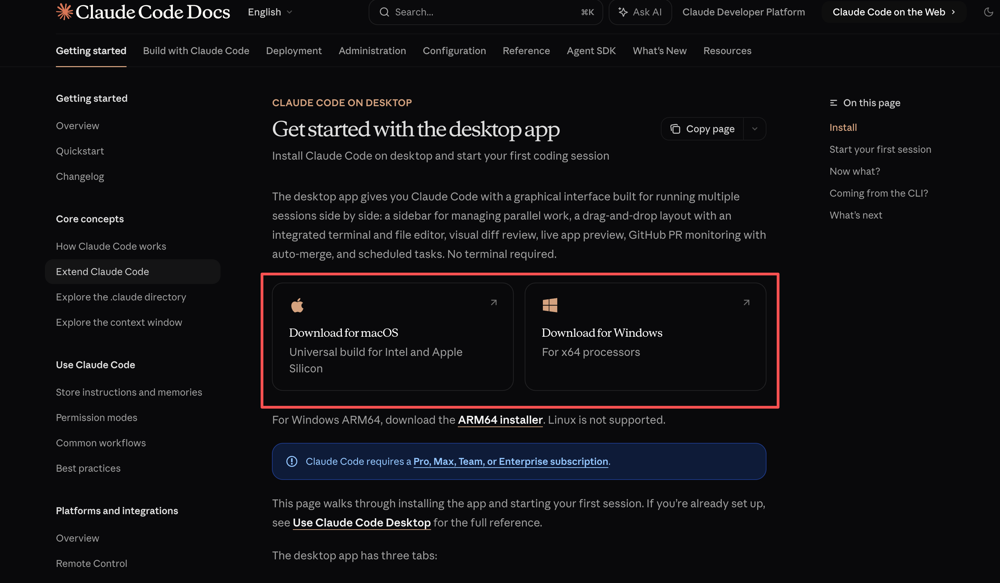
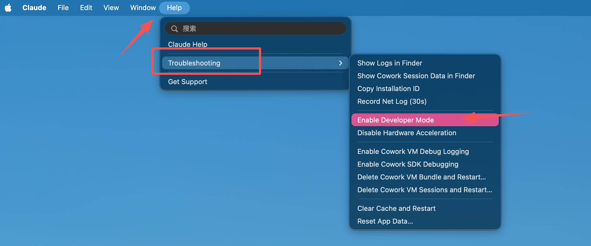
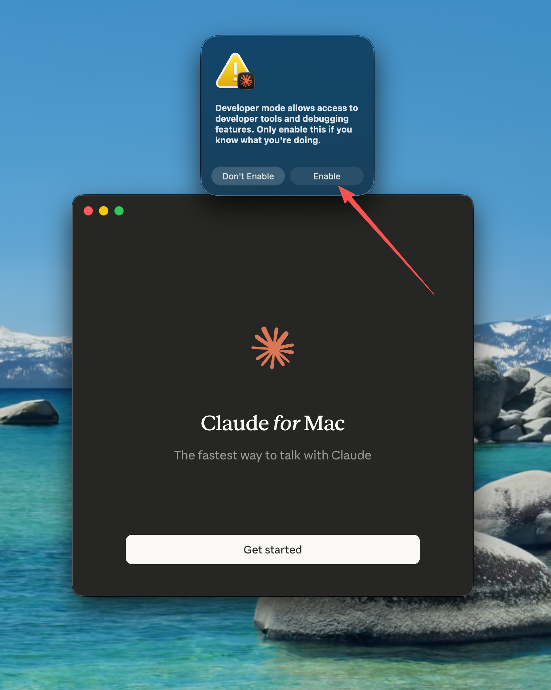
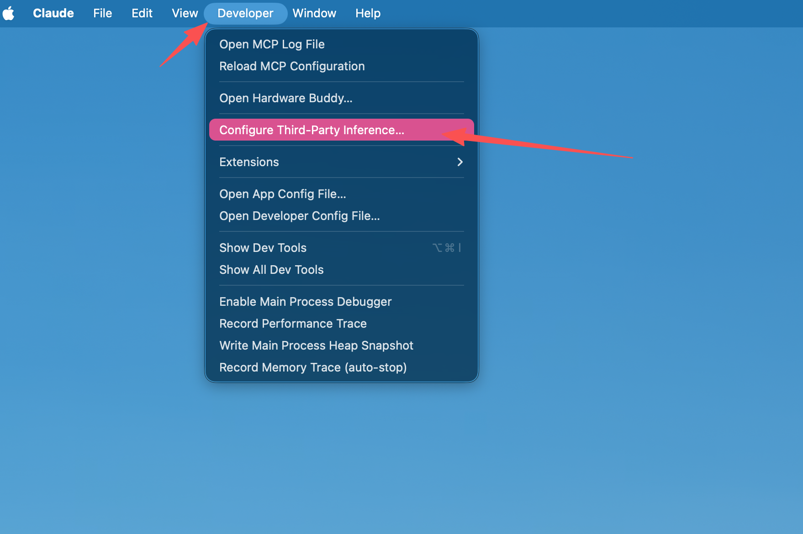
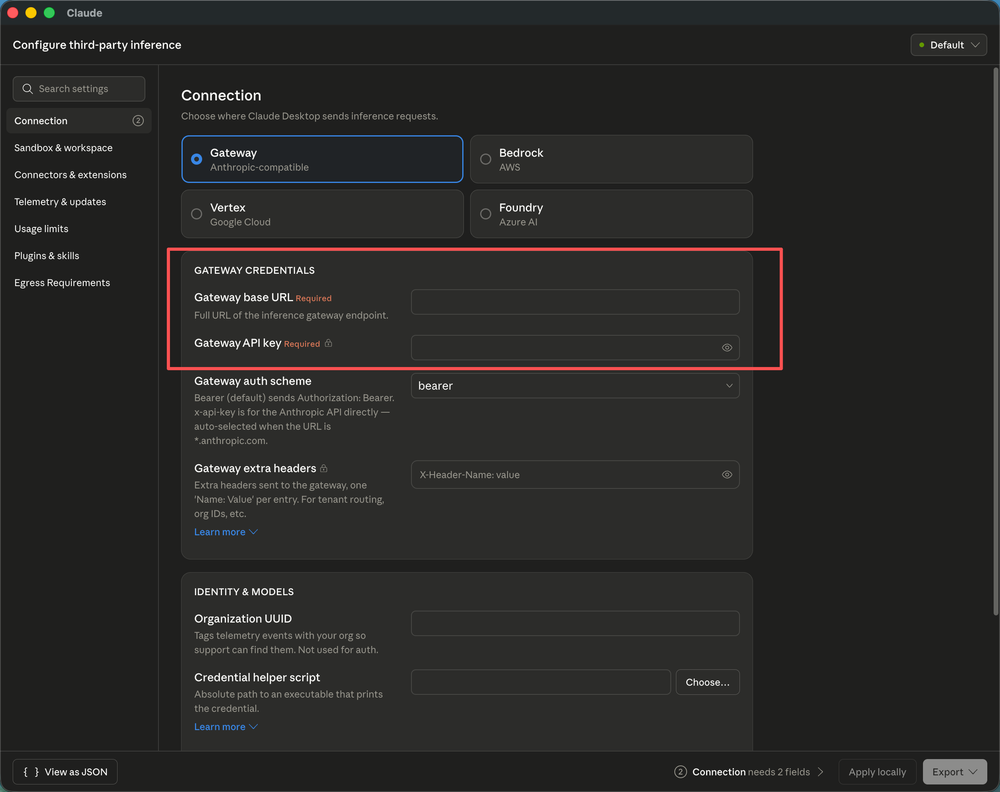
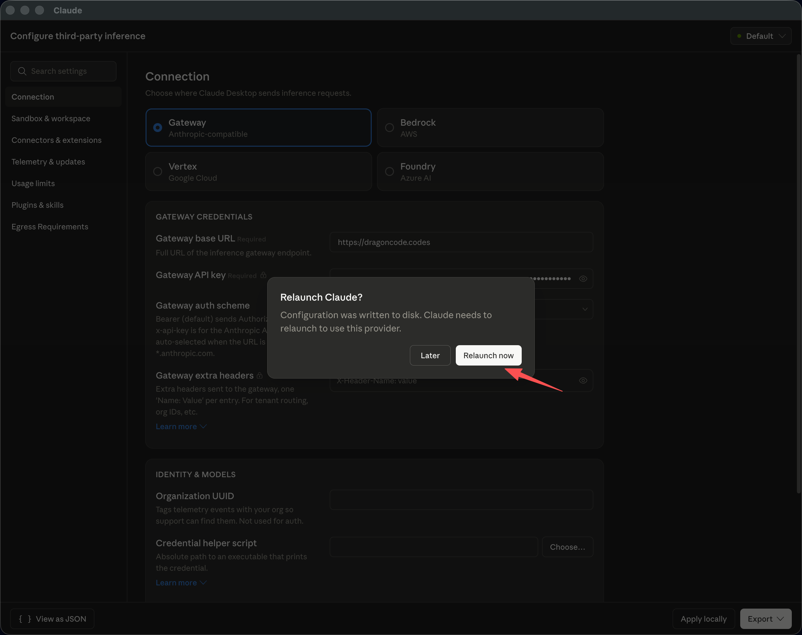
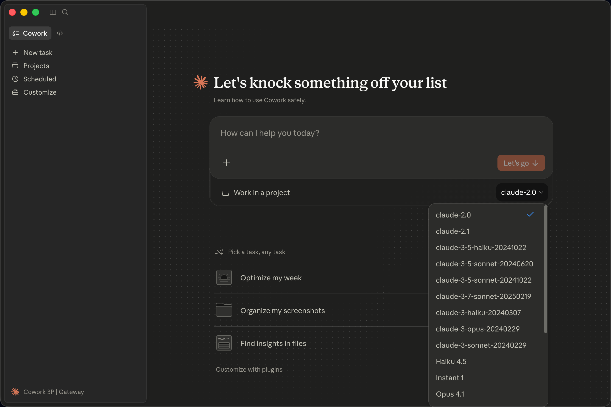
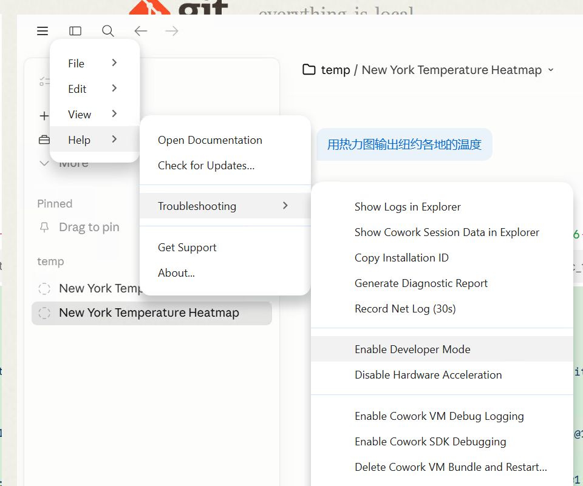
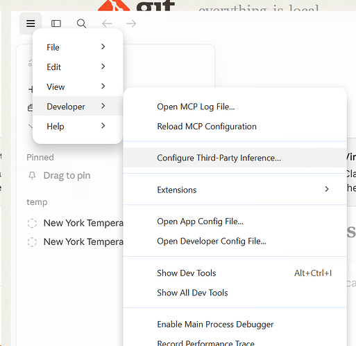
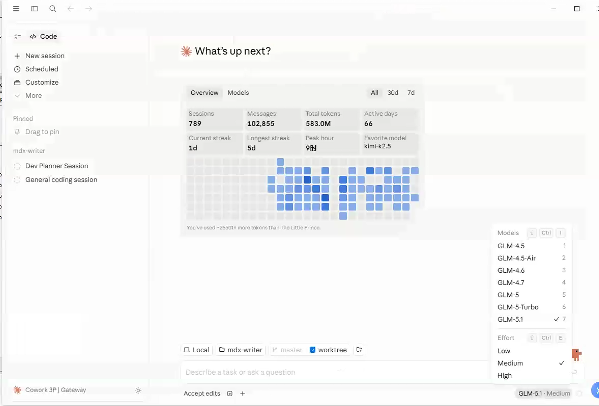

# 导入到 Claude Desktop

Claude Desktop 支持配置第三方 Provider。通过 yylx.io 接入后，Claude Desktop 会使用你在控制台创建的 API Key，通过 yylx.io 网关访问模型服务。

> [!INFO]
> 这一页适用于 Claude Desktop 的第三方 Provider / Gateway 配置流程。Claude Code 的环境变量配置请查看 [导入到 Claude Code](claude-code.md)。

## 前置准备

开始之前，请先准备好下面几项：

| 项目 | 说明 |
| --- | --- |
| Claude Desktop | 已安装并至少打开过一次 |
| API Key | 在 yylx.io 控制台创建的 Key，建议单独命名为 `claude-desktop` |
| Gateway base URL | `https://app.yylx.io` |

如果控制台「使用密钥」弹窗中展示了专门用于 Claude/Anthropic 的地址，请优先使用控制台展示的地址。

## 下载 Claude Desktop

如果你还没有安装 Claude Desktop，可以先打开官方文档下载安装：

[Claude Desktop 下载](https://code.claude.com/docs/en/desktop-quickstart)

## macOS 配置流程

### 启用开发者模式

1. 打开 Claude Desktop 客户端。
2. 点击顶部菜单栏的 **Help（帮助）**，依次选择 **Troubleshooting** → **Enable Developer Mode**。

   

3. 在确认对话框中点击 **Enable**。Claude Desktop 会自动重启。

   

### 配置第三方 Provider

1. 重启后进入欢迎界面，先不要登录。保持 Claude Desktop 处于选中状态，此时顶部菜单栏会出现 **Developer**。

   

2. 点击 **Developer** → **Configure Provider**，打开配置面板。

3. 填写 yylx.io 的网关信息。

   

| 配置项 | 填写内容 |
| --- | --- |
| **Gateway base URL** | `https://app.yylx.io` |
| **Gateway API key** | yylx.io 控制台创建的 API Key |

4. 点击右下角的 **Apply locally**。
5. 在弹出的确认框中选择 **Relaunch now** 重启应用。

   

6. 重启后点击 **Continue with gateway**，进入 Claude Desktop 主界面。

   

## 界面说明

进入主界面后，可以使用下面的快捷键切换视图：

| 快捷键 | 功能 |
| --- | --- |
| `Command + 1` | Cowork 界面，默认视图 |
| `Command + 2` | 编码界面 |

## Windows 配置流程

Windows 端的配置逻辑与 macOS 基本一致，主要区别是打开开发者菜单的方式不同。

### 启用开发者模式

1. 打开 Claude Desktop，进入欢迎界面的邮箱输入页面。
2. 按 `Tab` 键切换焦点，直到左上角的菜单图标被选中。
3. 按 `Enter` 键打开菜单。

   

4. 选择 **Developer** → **Configure third-party interface**。

   

### 配置接口信息

填写 yylx.io 的 Gateway 地址和 API Key，然后点击 **Apply locally**，按提示重启生效。

| 配置项 | 填写内容 |
| --- | --- |
| **Gateway base URL** | `https://app.yylx.io` |
| **Gateway API key** | yylx.io 控制台创建的 API Key |

## 常见问题

| 问题 | 处理方式 |
| --- | --- |
| 配置后无法连接 | 检查 Gateway URL 是否以 `https://` 开头，API Key 是否完整有效 |
| 配置后没有变化 | 确认点击了 **Apply locally**，并完全退出后重新打开 Claude Desktop |
| 提示认证失败 | 回到 yylx.io 控制台重新复制 API Key，确认没有多余空格 |
| 请求没有出现在使用记录里 | 确认当前 Claude Desktop 选择的是 yylx.io Gateway，而不是官方登录或其他 Provider |

## 相关资源

- [Claude Desktop 官方文档](https://code.claude.com/docs/en/desktop-quickstart)
- [创建 API Key](create-api-key.md)
- [导入到 Claude Code](claude-code.md)
