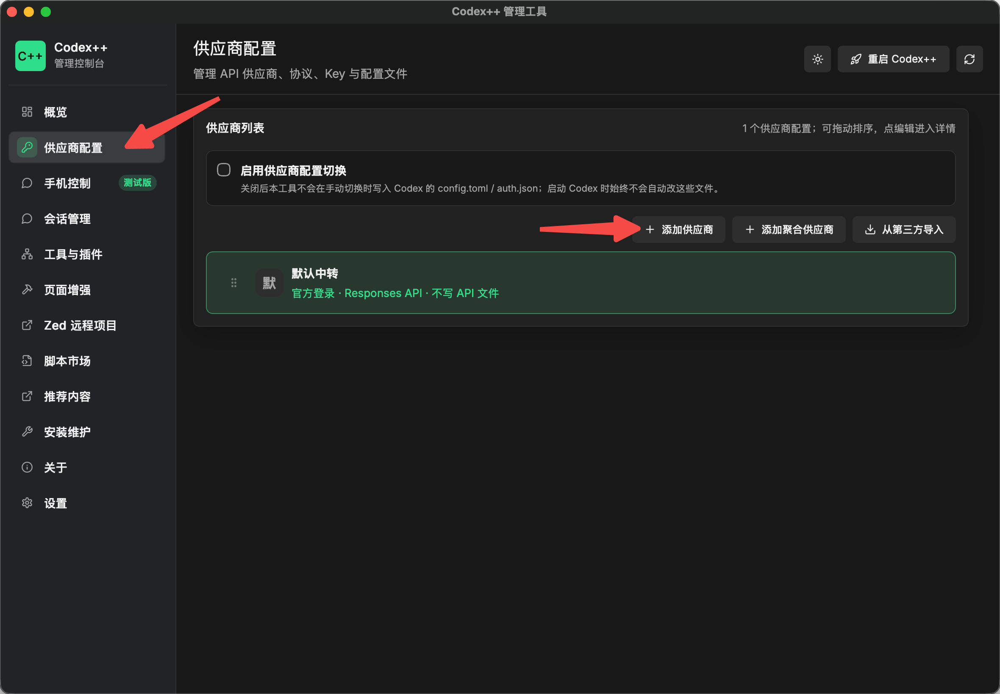
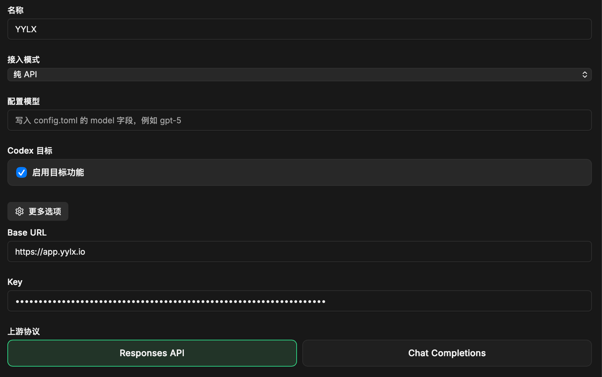
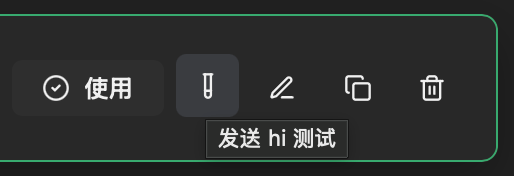

# 导入到 Codex++

> [!WARNING]
> Codex++（CodexPlusPlus）是一个**第三方**的 Codex 桌面客户端增强工具，**不是 OpenAI 官方 Codex**。
> 如果你要配置的是官方 **Codex CLI**（命令行、手改 `~/.codex/config.toml`），请改看 [导入到 Codex](codex.md)。
> 两者名字相近但用途不同，请勿混淆。

Codex++ 通过一个外部启动器拉起 Codex 桌面客户端，并注入增强功能，本身不修改 Codex 的安装文件。接入 yylx.io 走的是它的「供应商配置」功能：你在管理工具的图形界面里把 yylx.io 添加为一个供应商，它会替你把配置写进 Codex，之后用 `Codex++` 入口启动即可。

## 前置准备

| 项目 | 说明 |
| --- | --- |
| Codex 桌面客户端 | 已安装并至少打开过一次（Codex++ 是它的外部启动器，不是替代品） |
| Codex++ | 从 GitHub Releases 下载安装，装完会有 `Codex++`（静默启动）和 `Codex++ 管理工具`（控制面板）两个入口 |
| API Key | yylx.io 控制台创建的 Key，建议名称带 `codex`，后续排查消耗时更清楚 |

先在 yylx.io 控制台进入「API 密钥」页面，创建或选择一个专门给 Codex 使用的 Key，复制备用。不要把完整 Key 发到公开聊天或 issue 中。

## 下载安装 Codex++

Codex++ 是开源项目，源码托管在 GitHub：[BigPizzaV3/CodexPlusPlus](https://github.com/BigPizzaV3/CodexPlusPlus)。

1. 打开 [Releases 页面](https://github.com/BigPizzaV3/CodexPlusPlus/releases)。
2. 在最新版本的资源列表中，根据自己的操作系统选择对应的安装包：
   - Windows：`CodexPlusPlus-*-windows-x64-setup.exe`
   - macOS Intel：`CodexPlusPlus-*-macos-x64.dmg`
   - macOS Apple Silicon：`CodexPlusPlus-*-macos-arm64.dmg`
3. 按系统正常方式安装。安装后会出现两个入口：`Codex++`（静默启动，只负责启动 Codex 并注入增强）和 `Codex++ 管理工具`（控制面板）。
4. 至少打开一次 `Codex++ 管理工具`，方便后续配置。

## 添加 yylx.io 供应商

打开 `Codex++ 管理工具`，点击左侧的「供应商配置」。

> [!NOTE]
> 确认顶部的「启用供应商配置切换」处于勾选状态（默认开启）。关闭时，下面的「使用」按钮不可用，配置只会被保存、不会写入 Codex。

### 1. 添加供应商

点击「添加供应商」。

### 2. 从模板创建并填写

点击「从预设模板创建」，选择官方的「OpenAI Official」，然后按下表填写：

| 配置项 | 填写内容 |
| --- | --- |
| 名称 | `YYLX`（这条供应商的显示名，方便你自己识别） |
| 接入模式 | 纯 API |
| 配置模型 | 留空，不用写 |
| Base URL | `https://app.yylx.io` |
| Key | yylx.io 控制台创建的 API Key |
| 上游协议 | Responses API |

> [!INFO]
> 表单里的「Codex 目标 / 启用目标功能」是 Codex 自带的「长期目标模式」开关（对应 `features.goals`），和接入 yylx.io 无关，保持默认即可。

填好后，在「模型列表」处点击「从上游获取」拉取 yylx.io 提供的模型，再点击左上角的「保存」。

## 测试并启用

1. 回到供应商列表，找到刚添加的 `YYLX`，点击右侧的「测试」按钮（发送 hi 测试）。弹窗中出现 `HTTP 200` 字样即表示配置可用。

   

2. 点击左侧的「使用」按钮，把 Codex 切换到 `YYLX` 配置——Codex++ 会据此写入 `~/.codex/config.toml`。
3. 启动 `Codex++`（**不要用原版 Codex 启动**）即可。第一次使用时，建议先发一个轻量请求，确认已经生效。

> [!INFO]
> 启用后，Codex++ 会自动在 `~/.codex/config.toml` 写入一条 `model_provider`（由 Codex++ 自动管理，不同版本可能是 `custom` 等内部标识符）。这个名字只是配置文件里的内部标识符，**不需要也不建议手动改成 `yylx`**——决定请求走到 yylx.io 的是 Base URL 和 API Key，而不是这个名字，手动改名在下次切换时还会被覆盖。想要好认的名字，把上一步的「名称」填成 `YYLX` 即可。

## 验证请求走到 yylx.io

可以从两边验证：

| 位置 | 看什么 |
| --- | --- |
| Codex 界面 | 是否能正常返回，是否出现认证或模型不存在错误 |
| yylx.io 使用记录 | 是否出现刚才这次请求 |

如果 yylx.io 使用记录中没有请求，通常说明 Codex 没有切换到 `YYLX` 供应商，或者没有用 `Codex++` 入口启动。

## 常见问题与排查

| 问题 | 处理方式 |
| --- | --- |
| 「使用」按钮点不动、是灰色的 | 确认顶部「启用供应商配置切换」已勾选 |
| 提示认证失败 | 回到 yylx.io 控制台重新复制 API Key，确认没有多余空格 |
| 报模型不存在 | 重新「从上游获取」模型列表，确认选用的模型名与控制台一致 |
| 请求没有出现在使用记录里 | 确认是用 `Codex++` 入口启动，且当前「使用中」的是 `YYLX` 供应商，而不是官方登录或其他配置 |

## 相关资源

- [导入到 Codex](codex.md)（官方 Codex CLI）
- [创建 API Key](create-api-key.md)
- [CodexPlusPlus 项目](https://github.com/BigPizzaV3/CodexPlusPlus)
