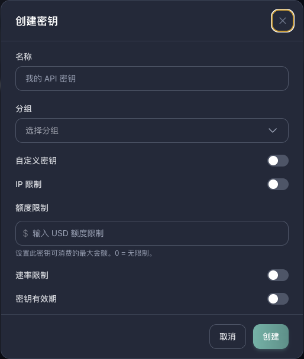

# 创建 API Key

API Key 是调用 yylx.io 接口的访问凭证。后续无论接入 Claude Code、Codex、Cursor、Cherry Studio，还是通过 CC Switch 管理多个工具，都需要先在控制台创建一个可用的 Key。

建议为每个客户端单独创建 API Key，例如 Claude Code 一个、Cursor 一个、Cherry Studio 一个。这样做有两个好处：一是可以按工具查看消耗来源，二是某个客户端泄露时只需要禁用对应 Key，不会影响其他工具。

> [!WARNING]
> API Key 等同于账户调用凭证。公开 Key 可能导致额度被他人消耗，发现泄露后请立即删除旧 Key 并重新创建。

## 进入 API 密钥页面

登录 yylx.io 控制台后，在左侧菜单进入「我的账户」下的「API 密钥」页面。页面右上角可以刷新列表，也可以点击「创建密钥」新增一个 Key。


如果列表中已经有旧 Key，也不要直接复用到所有工具。更推荐按工具新建，例如 `claude-code-mac`、`codex-work`、`cursor-desktop`。

## 创建密钥

点击「创建密钥」后，会出现创建弹窗。最少只需要填写名称并选择分组；其他限制项可以按使用场景开启。



推荐按下面的顺序填写：

1. 「名称」填写能看懂用途的名字，例如 `macbook-codex`、`cursor-work`、`cherry-studio-home`。
2. 「分组」选择要使用的模型线路或套餐分组。不同分组的倍率、可用模型可能不同，请以控制台展示为准。
3. 「额度限制」可选。个人测试可以先不限制；给临时项目、团队成员或不常用设备时，建议设置一个小额度。
4. 「速率限制」可选。只有在你需要限制并发、避免某个工具异常消耗时再开启。
5. 「密钥有效期」可选。临时测试 Key 建议设置过期时间；长期使用的本机工具可以保持永久有效。
6. 确认后点击「创建」，并在创建成功后立即复制保存。

API Key 通常只会完整展示一次。如果忘记保存，请删除旧 Key 后重新创建。

> [!TIP]
> 不建议开启「自定义密钥」，除非你明确知道为什么要固定 Key 字符串。自动生成的 Key 更安全，也更不容易与旧配置混淆。

## 命名建议

| 场景 | 示例名称 |
| --- | --- |
| Codex CLI | `codex-macbook` |
| Claude Code | `claude-code-work` |
| Cursor | `cursor-desktop` |
| Cherry Studio | `cherry-studio-home` |
| 团队成员 | `alice-dev` |

## 保存和使用

创建成功后，请把 Key 存到密码管理器、系统钥匙串或只在本机可读的环境变量中。不要把 Key 写进公开仓库、截图、聊天记录或共享文档。

如果你要接入 Claude Code，可以在 API 密钥列表中点击「使用密钥」，控制台会展示对应的环境变量和配置片段；如果要接入 CC Switch，可以点击「导入到 CCS」走一键导入。

## 测试 Key 是否可用

创建后可以使用下面的命令测试 OpenAI 兼容接口是否可访问：

```bash
curl https://api.yylx.io/v1/models \
  -H "Authorization: Bearer sk-your-api-key"
```

如果返回模型列表，说明 API Key 和 Base URL 基本可用。

如果测试失败，可以先检查四件事：

| 检查项 | 说明 |
| --- | --- |
| Key 是否完整 | 复制时不要漏字符，也不要带上多余空格或换行 |
| 分组是否可用 | 分组需要启用，并且包含你要调用的模型 |
| 余额或额度 | 账户余额、订阅额度、Key 额度都可能影响请求 |
| Base URL | OpenAI 兼容客户端通常填写 `https://api.yylx.io/v1` |

## 后续维护

定期清理不用的 Key。长期不用、用途不明、疑似泄露的 Key 都应该禁用或删除。删除后，已经配置到客户端里的旧 Key 会立即失效，需要重新创建并更新客户端配置。
